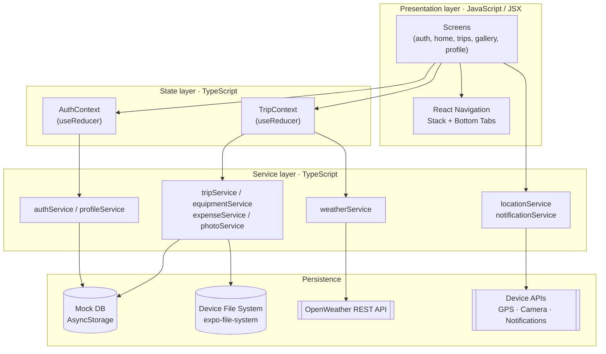

<div align="center">

# Adventure Trip Planner

**A cross-platform mobile app for planning, organizing, and tracking outdoor adventure trips —
hiking, camping, cycling, road trips, mountain and beach adventures — all in one place.**

[](https://docs.expo.dev/)
[](https://reactnative.dev/)
[](https://www.typescriptlang.org/)
[](#building-a-release-apk)
[](#license)

Final examination project for **ITS 2127 – Advanced Mobile Developer**
Graduate Diploma in Software Engineering · IJSE

[Overview](#overview) ·
[Features](#features) ·
[Architecture](#architecture) ·
[Getting Started](#getting-started) ·
[Build](#building-a-release-apk) ·
[Requirement Mapping](#requirement-mapping)

</div>

---

## Overview

Adventure travelers typically juggle a separate app for maps, another for weather, a spreadsheet
for shared costs, and a group chat for packing lists. **Adventure Trip Planner** consolidates all
of that into a single, focused mobile experience: create a trip, see the live forecast for the
destination, split costs with the group, track a shared packing checklist, and keep a photo
gallery — all backed by a fully typed, async data layer with real loading and error states.

The project satisfies every mandatory requirement of the ITS 2127 brief while going further on the
**Creativity & Innovation** and **State Management & Authentication** criteria: a strict
TypeScript logic layer, a type-safe generic data-access layer, three native device API
integrations, and a genuine external REST API call.

## Features

<table>
<tr><td width="50%" valign="top">

**Core**
- Email/password authentication with persistent sessions
- Full CRUD on the central `Trip` entity (title, destination, dates, activity type, GPS, cover photo)
- Equipment checklist with pack/unpack tracking and assignment
- Expense splitter with automatic even-split and per-payer balances
- Search and filter trips by destination, title, and activity type

</td><td width="50%" valign="top">

**Beyond the brief**
- Live weather forecast via the OpenWeather REST API
- Interactive map picker (tap-to-drop-pin) plus GPS auto-fill
- Camera / photo library integration for a trip gallery
- Local push notification reminders (trip start, unpacked items)
- Editable profile with avatar upload, light/dark theme toggle

</td></tr>
</table>

## Architecture

The client talks to a **local mock backend** (per the brief's "mock server" option) instead of a
hosted API — every service exposes the same async, Promise-based, loading/error-aware interface a
real REST or Firestore integration would, so swapping the backend later only touches
`src/services/*`.



**Design decisions:**
- **Context API + `useReducer`**, not Redux — two isolated reducers (`AuthContext`, `TripContext`)
  keep auth and trip state independently testable, each exposing granular `loading`/`error`
  objects per async operation to avoid one global spinner and prevent unrelated re-renders.
- **Strict TypeScript on the logic layer only.** Screens/components/navigation stay in
  JavaScript/JSX (fast iteration on UI), while everything with real business logic — types, the
  mock database, every service, both contexts — is TypeScript with `strict: true` and zero
  `tsc` errors. See [Language Split](#language-split).
- **Generic, type-safe data access.** `getCollection<K>()` / `setCollection<K>()` in
  `src/mock/mockDatabase.ts` are generic over the database shape, so every service gets
  compile-time-checked reads/writes without casting.

## Technology Stack

| Layer | Technology |
|---|---|
| Framework | React Native 0.81 + Expo SDK 54 |
| Language | TypeScript (strict) for logic · JavaScript/JSX for UI — see [Language Split](#language-split) |
| Navigation | React Navigation — Native Stack + Bottom Tabs |
| State Management | React Context API + `useReducer` (`AuthContext.tsx`, `TripContext.tsx`) |
| Data Persistence | Local mock server (`src/mock`, `src/services`) over AsyncStorage |
| File Storage | `expo-file-system` (photos/avatars copied into the app's document directory) |
| External REST API | [OpenWeather](https://openweathermap.org/api) (live network call, not mocked) |
| Native Device APIs | Expo Location, Expo Image Picker (camera + library), Expo Notifications |
| Maps | `react-native-maps` |
| UI Kit | React Native Paper (Material Design 3) |
| Build & Distribution | EAS Build (Android APK / AAB) |

### Language Split

The brief lists **JavaScript / TypeScript** as the accepted frontend languages, so this project
deliberately uses both, split by concern rather than mixed at random:

| Layer | Language | Why |
|---|---|---|
| `src/types` | TypeScript | Single source of truth for every domain shape (`Trip`, `Expense`, `EquipmentItem`, `Photo`, `UserProfile`, …) |
| `src/mock`, `src/services` | TypeScript (strict) | Business logic and data access benefit most from compile-time safety; a generic, type-checked mock database accessor lives here |
| `src/context` (`.tsx`) | TypeScript | Both reducers use discriminated-union action types instead of untyped `{ type, payload }` objects |
| `src/screens`, `src/components`, `src/navigation` | JavaScript / JSX | UI iterates fast without type ceremony; Metro bundles `.js`/`.ts`/`.tsx` together with zero extra config |

Run `npm run typecheck` (`tsc --noEmit`, strict mode) — it passes with **zero errors**.

## Project Structure

```
adventure-trip-planner/
├── App.js                      # Root component: providers, theme, navigation
├── app.json                    # Expo config (permissions, plugins, EAS project link)
├── eas.json                    # EAS Build profiles (development / preview / production)
├── tsconfig.json                # Strict TypeScript config (extends expo/tsconfig.base)
└── src/
    ├── components/             # Reusable UI: TripCard, WeatherWidget, EmptyState, …        [.js]
    ├── screens/                                                                              [.js]
    │   ├── auth/                # Splash, Login, Register, ForgotPassword
    │   ├── home/                # Dashboard: search, quick actions, upcoming-trip weather
    │   ├── trips/                # List / detail / form, equipment, expenses, map picker
    │   ├── gallery/               # Photo gallery
    │   └── profile/              # Profile, edit profile, notification settings
    ├── navigation/              # Auth stack, main tabs, root stack, root switch            [.js]
    ├── context/                 # AuthContext, TripContext (Context API + useReducer)        [.tsx]
    ├── services/                # Auth/Trip/Equipment/Expense/Photo/Profile/Weather services [.ts]
    ├── mock/                    # AsyncStorage-backed mock "database", seed data, latency     [.ts]
    ├── types/                   # Shared domain interfaces                                    [.ts]
    ├── utils/                   # Form validators, date helpers                                [.ts]
    └── theme/                   # Palette, spacing scale, activity-type metadata                [.ts]
```

## Getting Started

### Prerequisites

| Requirement | Notes |
|---|---|
| [Node.js](https://nodejs.org/) 18+ | |
| [Expo Go](https://expo.dev/go) | On your physical Android/iOS device — must be on **SDK 54** (see troubleshooting below) |
| [OpenWeather API key](https://openweathermap.org/api) | Free tier; only needed for the live weather feature |

### Installation

```bash
git clone https://github.com/Hashini1234/AMD_FinalCourseWork_AdventureTripPlanner-.git
cd AMD_FinalCourseWork_AdventureTripPlanner-

npm install
cp .env.example .env          # then add your OpenWeather API key
npm start
```

Scan the QR code with **Expo Go** (Android) or the **Camera app** (iOS). Press `a` for an Android
emulator or `i` for the iOS simulator (macOS only).

<details>
<summary><strong>Expo Go reports a version mismatch?</strong></summary>

<br>

Expo Go only ever supports the *current* published SDK release. If `expo start` errors with
`Project is incompatible with this version of Expo Go`:

1. Update Expo Go from the Play Store / App Store, **or**
2. Check the SDK your installed Expo Go supports and align the project to it:
   ```bash
   npx expo install expo@<their-sdk-version>
   npx expo install --fix
   ```
   If that reports peer-dependency conflicts, delete `node_modules` and `package-lock.json` and
   run `npm install` again. This project currently targets **Expo SDK 54**.

</details>

### Available Scripts

| Command | Description |
|---|---|
| `npm start` | Start the Metro bundler (scan QR with Expo Go) |
| `npm run android` | Start and open on a connected Android device/emulator |
| `npm run ios` | Start and open on the iOS simulator (macOS only) |
| `npm run web` | Run in a browser (limited native feature support) |
| `npm run typecheck` | Type-check every `.ts`/`.tsx` file (`tsc --noEmit`, strict) |

## Demo Account

No sign-up required to explore the app — a seeded account with one populated trip is available
on first launch:

| Field | Value |
|---|---|
| Email | `demo@adventure.com` |
| Password | `password123` |

Tap **"Use Demo Account"** on the Login screen, or register your own account. **Profile → Reset
Mock Data** wipes all local data and restores the original seed at any time — useful right before
a demo or viva.

## Mock Backend

There is no server to host and no third-party account to configure beyond OpenWeather.
`src/mock/mockDatabase.ts` persists a small JSON "database" to AsyncStorage, and every function in
`src/services/*` reads/writes it behind an async interface indistinguishable from a real
REST/Firestore call — including a simulated network delay so loading states are actually visible,
per the brief's "efficient asynchronous handling" criterion.

```
users      { uid, name, email, passwordHash, authProvider, photoUrl, createdAt }
trips      { tripId, ownerId, title, destination, country, activityType, description,
             startDate, endDate, latitude, longitude, coverImage, createdAt, updatedAt }
equipment  { itemId, tripId, name, isPacked, assignedTo }
expenses   { expenseId, tripId, category, description, amount, paidBy, date, createdAt }
photos     { photoId, tripId, imageUrl, uploadedBy, caption, uploadedAt }
```

`Trip` is the central CRUD entity; `equipment`, `expenses`, and `photos` are flat collections
keyed by `tripId` — the mock equivalent of Firestore sub-collections. Deleting a trip cascades and
removes its related equipment, expenses, and photos.

> **Swapping in a real backend later** (Firebase, Supabase, a custom Node/Express API) only
> requires rewriting `src/services/*` — `AuthContext`, `TripContext`, and every screen call the
> exact same function signatures regardless of what's underneath.

## OpenWeather API Setup

1. Create a free account at [openweathermap.org](https://openweathermap.org/api).
2. Copy your key from **My API Keys**.
3. Add it to `.env`:
   ```
   EXPO_PUBLIC_OPENWEATHER_API_KEY=your_key_here
   ```
   New keys can take up to a couple of hours to activate.

## Building a Release APK

This project builds via [EAS Build](https://docs.expo.dev/build/introduction/), configured with
three profiles in `eas.json`:

| Profile | Output | Use case |
|---|---|---|
| `development` | Dev client | Local development with custom native modules |
| `preview` | **`.apk`** | Sideloadable install — used for this submission |
| `production` | `.aab` | Google Play Store submission |

```bash
npm install -g eas-cli
eas login
eas build --platform android --profile preview
```

Download the finished `.apk` from the link EAS prints, or from your
[expo.dev dashboard](https://expo.dev/) → **Builds**. Either sideload it onto a device or share
the link directly as part of the submission.

## Requirement Mapping

Mapped directly against the ITS 2127 assignment brief's **Project Requirements** section:

| Requirement (per brief) | Implementation |
|---|---|
| **Frontend** — React Native Expo or any cross-platform technology | React Native + Expo SDK 54, JavaScript **and** TypeScript |
| **Backend** — Optional (Firebase Firestore, mock server, or any backend) | Mock server option — `src/mock` + `src/services`, AsyncStorage + file system |
| **State Management** — React Context, Redux, or equivalent | Context API + `useReducer` (`AuthContext`, `TripContext`), explicit per-request loading/error state |
| **Authentication** — Firebase Auth / JWT / Mock auth | Mock email/password authentication with persistent sessions |
| **Core Functionality** — Full CRUD on a central data model | Full Create/Read/Update/Delete on `Trip`, plus related Equipment/Expense/Photo records |
| **Navigation** — At least one type (Stack, Tab) | Both — Native Stack Navigator **and** Bottom Tab Navigator |
| **Mobile App UI** — Intuitive, responsive, user-friendly | Themed design system, light/dark mode, loading skeletons, empty states, inline validation |
| **Builds** — At least one Android (APK) or iOS build | Android APK via EAS Build |

**Beyond the minimum:** a genuine RESTful API integration (OpenWeather) and three native device
API integrations (Location, Camera/Image Picker, Notifications) toward the Creativity &
Innovation criterion.

## Known Limitations / Roadmap

Deliberately scoped out of this coursework submission (see the original project proposal for the
full long-term vision):

- AI-powered itinerary and packing suggestions
- Collaborative multi-user trip planning with shared roles
- Real-time in-trip group chat
- Emergency SOS with live location broadcast
- Offline map downloads
- A custom Node.js/Express backend replacing the mock layer

Because the mock backend is local to each device, data does not sync across devices or survive an
uninstall — swapping in Firebase or a custom API (see `src/services/*`) is the natural next step
if persistent, multi-device data is required.

## License

Produced as academic coursework for **ITS 2127 – Advanced Mobile Developer**,
Graduate Diploma in Software Engineering, IJSE. Not licensed for reuse or redistribution.

---

<div align="center">

**Course:** ITS 2127 – Advanced Mobile Developer · Graduate Diploma in Software Engineering
**Institute:** IJSE

</div>
